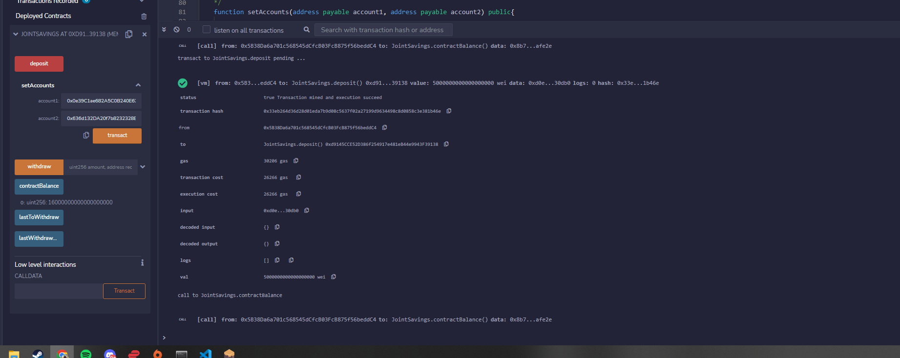

# Joint Savings Account

## Background

The follwing program is a Solidity smart contract that accepts two user addresses. These addresses will be able to control a joint savings account. The smart contract will use ether management functions to implement a financial institution’s requirements for providing the features of the joint savings account. These features will consist of the ability to deposit and withdraw funds from the account.

### Demo

1. Used the `setAccounts` function to add addresses 1 (0x0e39C1ae682A5C0B240E627cF5D05E78519Ce9d0) and 2 (0x636d132DA20f7b8232328BbCbCEE004E43103513) to create account1 and account 2 respectivly

2. Tested the `deposit` functionality sending the following amounts of ether below. After each transaction, the `contractBalance` function is executed to verify that the funds were added to the contract.

     Transaction 1: Sent 1 ether as wei. (Total Contract = 1000000000000000000 wei or 1 ETH)

     Transaction 2: Sent 10 ether as wei. (Total Contract = 11000000000000000000 wei or 11 ETH)

     Transaction 3: Sent 5 ether as wei. (Total Contract = 16000000000000000000 wei or 16 ETH )

3. Tested  the contract’s withdrawal functionality:

   Withdrawing 5 ether into `accountOne` 

       
        
   Withdrawing 10 ether into `accountTwo`
        
      
        

The `contractBalance` function was used to verify that the funds were withdrawn from the contract contract. Also, `lastToWithdraw` and `lastWithdrawAmount` functions verified that the address and amount were correct for each account.

